# Evaluation Process

This diagram illustrates the complete flow of the AGENTS.md/CLAUDE.md evaluation process.

```mermaid
flowchart TB
    subgraph Input["📥 Input"]
        CLI["CLI: Local Directory"]
        API["UI: Git URL"]
    end

    subgraph Setup["🔄 Setup"]
        Clone["Clone Repository<br/>(if Git URL)"]
    end

    subgraph Context["🔍 Context Generation"]
        Analyze["Analyze Codebase<br/>(languages, structure,<br/>config files)"]
        AI_Context["AI Context Analysis<br/>(frameworks, architecture,<br/>patterns)"]
    end

    subgraph Discovery["📁 File Discovery"]
        Find_Files["Find AGENTS.md &<br/>CLAUDE.md Files"]
    end

    subgraph Evaluation["⚙️ Evaluation"]
        Evaluators["Run Evaluators<br/>(via AI agent prompts)"]
    end

    subgraph Curation["📊 Impact Curation"]
        Rank["AI Ranking<br/>(prioritize by impact)"]
    end

    subgraph Scoring["🎯 Scoring"]
        Score["Calculate Context Score<br/>& Assign Grade"]
    end

    subgraph Output["📤 Output"]
        Results["Curated Issues<br/>+ Score<br/>+ Recommendations"]
    end

    CLI --> Clone
    API --> Clone
    Clone --> Analyze
    Analyze --> AI_Context
    AI_Context --> Find_Files
    Find_Files --> Evaluators
    Evaluators --> Rank
    Rank --> Score
    Score --> Results
```

## Process Stages

1. **Input** - Accepts either a local directory path (CLI) or a Git URL (UI)
2. **Setup** - Clones the repository if a Git URL was provided
3. **Context Generation** - Analyzes the codebase structure, languages, and uses AI to identify frameworks and patterns
4. **File Discovery** - Locates all AGENTS.md and CLAUDE.md files in the repository
5. **Evaluation** - Runs evaluators via AI agent prompts to identify issues and improvements
6. **Impact Curation** - AI-powered ranking to prioritize issues by their impact
7. **Scoring** - Calculates a context score and assigns an overall grade
8. **Output** - Returns curated issues, score, and recommendations

## Supported AI Agents

The evaluation process supports multiple AI agents:

- **Claude Code** (default) - Anthropic's Claude Code CLI
- **OpenCode** - Alternative AI CLI agent

Use the `--agent` CLI option or the UI dropdown to select which agent to use.
